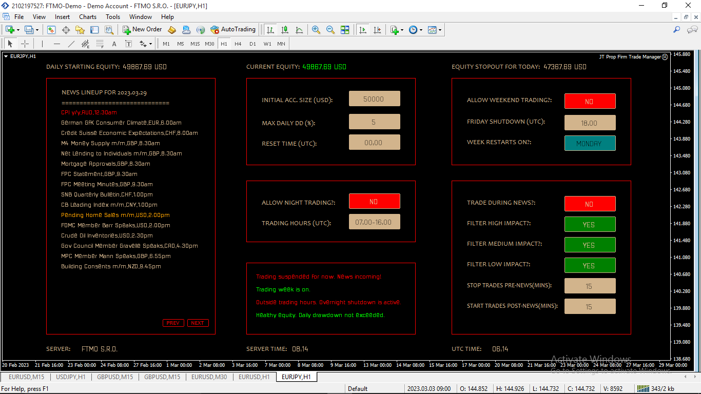

# MT4-Account-Manager
 MT4 EA to manage all kinds of account risks. It has configurable parameters to protect the account from violation of risk and equity based rules. It can disable/enable autotrading button, effectively pausing all automated trading activities. Very suitable for traders attempting to pass a prop firm challenge. 

 ## Preview

